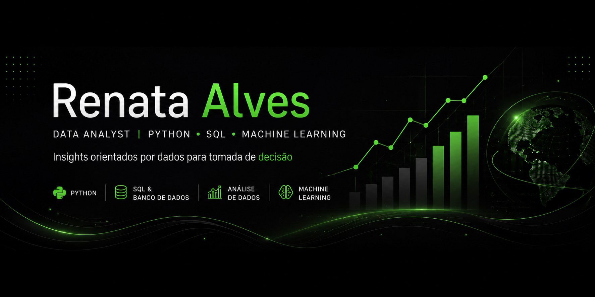

  

# 👋 Hi, I'm Renata Alves

### Data Science & Bioinformatics  
Python • SQL • Machine Learning  

📍 Based in Brazil

---

### 📊 Turning data into insights for real-world decisions

---

## 🛠️ Tech Stack

  
  
  
  
  
  
  
  
  
  
  

---

## 🧠 About Me

Background in Physics, currently transitioning into Data Science with focus on data analysis, machine learning and real-world problem solving.

I enjoy working with data to uncover patterns, generate insights and support decision-making processes.

---

## 🚀 Featured Project

### 📦 Olist Operational Analysis

Analysis of demand patterns, delivery performance and logistics efficiency using real-world data.

👉 [View Repository](https://github.com/realcoli/olist-operational-analysis)  
📓 [Open in Colab](https://colab.research.google.com/drive/12EJqpVnDTMaJ2UDV3VxwMqg1_k1JCHaw?usp=sharing)

### 📊 Delivery Users Behavior Analysis
Analysis of consumption patterns, customer spending, and tipping behavior for delivery platforms.
👉 [View Repository](https://github.com/realcoli/analise-usuarios-delivery) 
📓 [Open in Colab](https://colab.research.google.com/drive/1GNxiTzfROMjAwSE2AFFOtniFGfwDZZVO?usp=sharing)

---

## 📫 Contact

  
  

  

