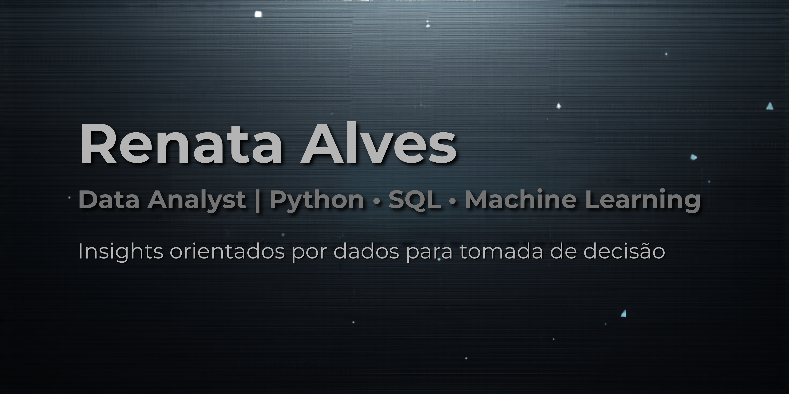

  

## 👩‍💻 Sobre mim

Bacharel em Física em transição para Data Science, com foco em análise de dados, Python e SQL.

Interesse em gerar insights e apoiar decisões em produtos digitais orientados por dados.

---

## 💻 Tecnologias

Python | Pandas | NumPy | SQL | Scikit-learn | Excel | Jupyter

---

## 📊 Projeto em destaque

### Análise de comportamento de usuários em plataforma de delivery

- análise exploratória de dados  
- identificação de padrões de navegação  
- modelagem preditiva (Regressão Logística)  
- geração de insights  

---

## 📫 Contato

LinkedIn: https://linkedin.com/in/realcoli
